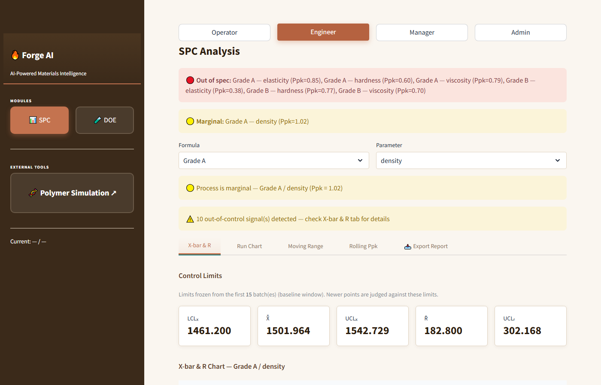
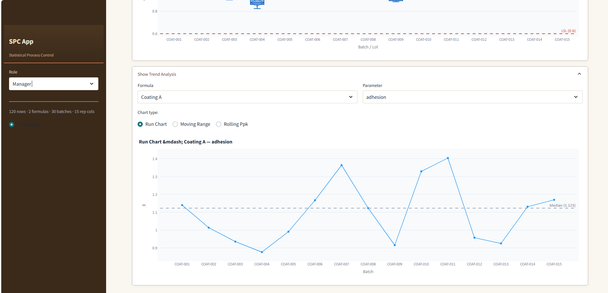
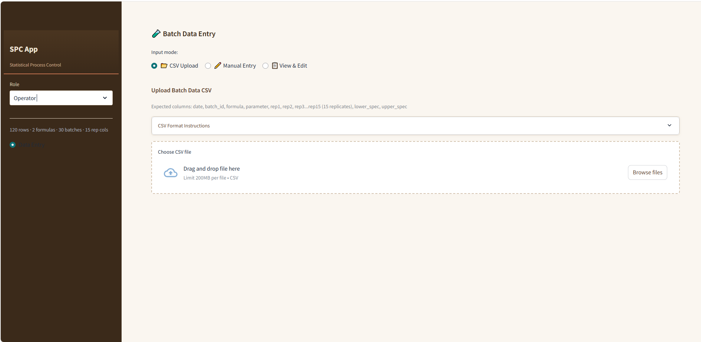
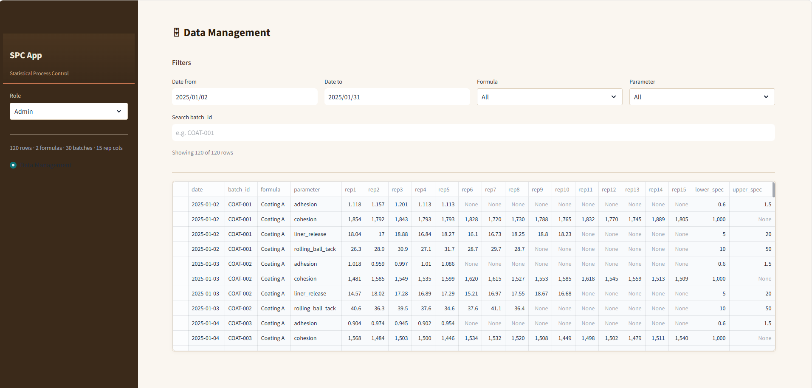

# 🔥  Forge AI

AI-Powered Materials Intelligence Platform — a Streamlit hub application for **Statistical Process Control (SPC)** of chemical batch coating processes and **Design of Experiments (DOE)** for process optimization. Tracks 4 quality parameters per batch with variable subgroup sizes (5–15 replicates) across multiple formulas.



## Features

### Hub Shell

- **Multi-app architecture** — SPC and DOE run as independent sub-apps within a shared hub
- **App selector sidebar** — big toggle buttons to switch between SPC and DOE
- **Role selector** — horizontal bar at the top of the main content area (Operator / Engineer / Manager / Admin)
- **Info bar** — shows current page and live data summary (rows, formulas, batches, replicates)
- **External tool links** — sidebar links to companion tools (e.g. Polymer Simulation)

### SPC — Statistical Process Control

- **X-bar & R control charts** with dynamic subgroup sizes (n=5–15) and ASTM E2587 constants
- **Western Electric rules** — Rule 1 (beyond 3σ), Rule 2 (2 of 3 beyond 2σ), Rule 4 (8 consecutive same side), trending (6 up/down)
- **Trend analysis** — run chart, moving range chart, rolling Ppk (sliding window)
- **Process capability** — Pp, Ppk, PPM with histogram and spec lines (supports one-sided specs via NaN)
- **Batch-to-batch boxplots** with spec line overlays
- **PPTX report export** — auto-generated SPC reports with charts and narrative summaries

### DOE — Design of Experiments

- **Full & fractional factorial designs** — 2^k full factorial, 2^(k-p) fractional factorial (Resolution IV/V), and Box-Behnken RSM designs
- **No external DOE library dependency** — self-contained factorial generators in pure NumPy
- **Regression analysis** — linear models with main effects + 2-way interactions, plus RSM quadratic models via statsmodels
- **Curvature detection** — automatic two-sample t-test comparing center-point vs. factorial-point responses
- **Visualization** — main effects plots, Pareto of effects, contour plots, 3D response surfaces
- **Derringer-Suich desirability** — multi-response optimization with prediction intervals and multi-start scipy optimization
- **One-sided response specs** — support for minimize-only or maximize-only objectives
- **Session persistence** — save, resume, and iterate on DOE experiments across sessions

### Platform

- **Role-based UI** — Operator (data entry), Engineer (SPC + DOE), Manager (dashboard), Admin (data management)
- **SQLite storage** with repository pattern (swappable to PostgreSQL)
- **CSV upload with validation + dedup** — archived with timestamp audit trail
- **Sample data** — pre-generated on first launch if the database is empty

## Screenshots

- **Operator — Data Entry** 
- **Engineer — SPC Analysis** 
- **Engineer — DOE Wizard** 
- **Manager — Dashboard** — KPI cards, status table, trend expander
- **Admin — Data Management** — Filter, edit, delete, export, import

## Tech Stack

| Layer      | Technology |
| ---------- | ---------- |
| UI         | Streamlit |
| Charts     | Plotly |
| SPC Engine | Pure Python (NumPy/SciPy) |
| DOE Engine | NumPy (self-contained generators), statsmodels, scipy.optimize |
| Reports    | python-pptx, Kaleido |
| Database   | SQLite (WAL mode) |
| Testing    | Pytest (90+ tests) |

## Installation

```bash
git clone https://github.com/newbison/spc-batch-monitor.git
cd spc-batch-monitor
pip install -r requirements.txt
```

No external DOE library required — the factorial generators (`doe/_factorial.py`) are self-contained and work on all Python versions (3.9+).

## Usage

```bash
streamlit run app.py
```

On first launch, sample data is auto-migrated from `data/coating_batches.csv` into SQLite. Select an app (SPC or DOE) from the sidebar, then choose your role from the top bar.

## Monitored Parameters

| Parameter         | Replicates | LSL    | USL    | Units   |
| ----------------- | ---------- | ------ | ------ | ------- |
| Adhesion          | 5          | 0.6    | 1.5    | N/mm    |
| Cohesion          | 15         | 1000.0 | —      | —       |
| Rolling Ball Tack | 8          | 10.0   | 50.0   | mm      |
| Liner Release     | 10         | 5.0    | 20.0   | g/inch  |

## Architecture

```text
app.py (Hub shell)
 ├── SPC sub-app
 │   ├── Role + info bar (top of main content)
 │   ├── Sidebar (engineer context: formula/param)
 │   ├── UI (Streamlit pages by role)
 │   │   └─> Visualization (Plotly chart builders)
 │   │        └─> SPC Engine (pure Python — no framework deps)
 │   │             └─> Data Access (repository pattern → SQLite)
 │   │                  └─> Validation (row-level guard before writes)
 │   └── Reports (python-pptx + Kaleido)
 │
 └── DOE sub-app
     ├── doe/_factorial.py   — self-contained fullfact, fracfact, bbdesign
     ├── doe/designs.py       — factorial + Box-Behnken design matrices
     ├── doe/analysis.py      — linear + RSM regression (statsmodels)
     ├── doe/optimization.py  — Derringer-Suich desirability (scipy)
     └── doe/persistence.py   — SQLite session CRUD (JSON columns)
```

All engines are **framework-agnostic** — they take DataFrames or arrays and return plain dicts. The repository pattern abstracts storage so SQLite can be swapped for PostgreSQL without touching UI or business logic.

## Testing

```bash
pytest tests/ -v
```

90+ tests covering:

- Control limits (X-bar & R with dynamic n)
- Western Electric rules (1, 2, 4, trending)
- Capability calculations (Pp, Ppk, PPM, one-sided specs)
- Data validation (rejects bad rows before write)
- SQLite repository operations (CRUD, dedup, auto-migration)
- End-to-end integration (SPC pipeline)
- DOE design generation (full factorial, fractional factorial, Box-Behnken)
- DOE regression analysis (linear, RSM, overparameterization guard)
- DOE desirability optimization (RMSE-based prediction intervals)
- DOE persistence (JSON columns, whitelist validation)
